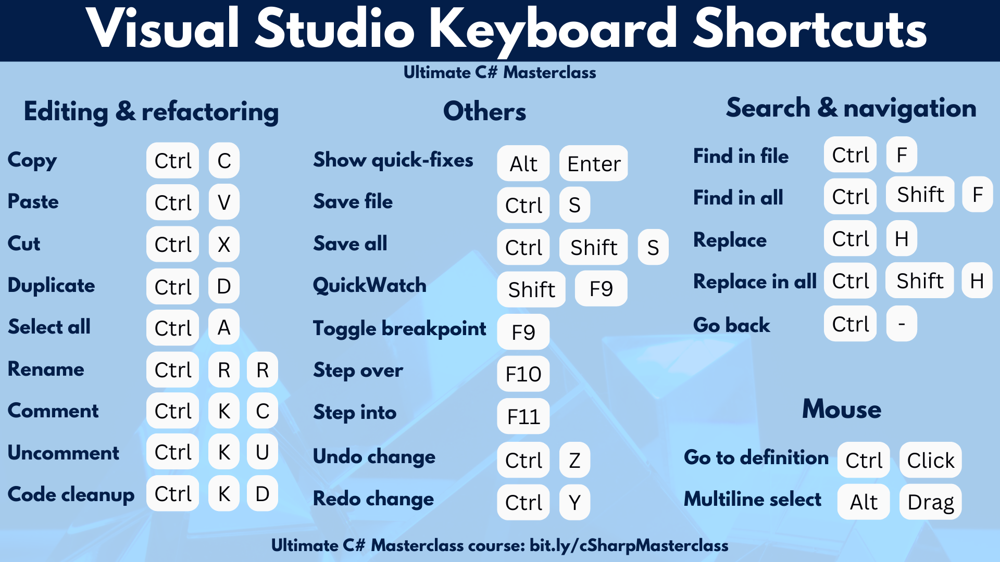

# Ultimate C# Masterclass for 2024

## Section 1: Introduction



!! VSTip: Ctrl + D  \\ Duplicate Line

## Section 2: C# Fundamentals

!! VSTip: Close Console window when debugging stops.

Tools > Options > Type "Automatically" > Debugging > General
    !! Automatically close the console when debugging stops.

### 17 Naming variables & introduction to clean code

Best Practice: camelCase
Keywords can not be used
    \\ @class  ! we must use '@' if we have to use keywords as  varibale
First character can not be digit

- Avoid abbrevation, Be precise, Take your time.

VSTip: Ctrl + R +R \\ Rename

[C# Keywords](https://learn.microsoft.com/en-us/dotnet/csharp/language-reference/keywords/)

[Common C# code conventions](https://learn.microsoft.com/en-us/dotnet/csharp/fundamentals/coding-style/coding-conventions)

### 18 Operators

[Operator precedence](https://learn.microsoft.com/en-us/dotnet/csharp/language-reference/operators/#operator-precedence)

### 19 Implicitly Typed Variables

Explicitly : int,string...  etc

Implicitily: var

### 20 User Input

[Ultimate C# Masterclass - Code snippets](https://docs.google.com/document/d/1jjwo5W-y4cVd3S5654tOU7dsN17vZYRTyLagv8DguUA/edit#heading%253Dh.fa7x4yjsosdd)

### 24 Boolean, Logical negatition, equality, comparison, and modulo operators

Modulo Operator :  %    i.e 10 % 3 == 1;

- can be used isEven, isOdd

### 25 AND  - OR logical operators

&& , ||

!!Term: Short-Circuiting
    if one condition is true which is with ||
    if one condition is false which is with &&
        It won't check the rest

### 26 if/else

### 27 The scope of local variables

### 28,29 Methods

!! Method name starts with UPPERCASE

parameter vs argument
    - Parameters: are the names listed in the methods definition
    - Arguments: actual values passed to this method, so parameters are with initialized values.

```csharp
namespace Coding.Exercise
{
    public class Exercise
    {
        public static int AbsoluteOfSum(int a , int b)
        {
            int result = a + b;
            
            if(result < 0)
            {
                result = -1 * result;
            }
            
            return result;
        }
    }
}


Coding.Exercise.UnitTests.FirstTestSuite.AbsoluteOfSum_ShallAddNumbersAndGetTheirValueWithoutTheSign(5,5,10)
Coding.Exercise.UnitTests.FirstTestSuite.AbsoluteOfSum_ShallAddNumbersAndGetTheirValueWithoutTheSign(-20,5,15)
Coding.Exercise.UnitTests.FirstTestSuite.AbsoluteOfSum_ShallAddNumbersAndGetTheirValueWithoutTheSign(5,-5,0)
Coding.Exercise.UnitTests.FirstTestSuite.AbsoluteOfSum_ShallAddNumbersAndGetTheirValueWithoutTheSign(-5,-5,10)

```

### 30 Methods III

- statically typed vs dynamically typed
  - C# is a statically typed programming language.
    - during the compilation, the compiler checks if there are no type mismatches in our code.
  - Python is dynamically typed language  

```csharp
var word = "abc";
word = 10; // will work for Python but not for C#
```

- runtime errors vs compilation errors
  - Runtime errors happen when the application is running in opposite to the compilation errors which happen
  - Compilation errors happen during the compilation
